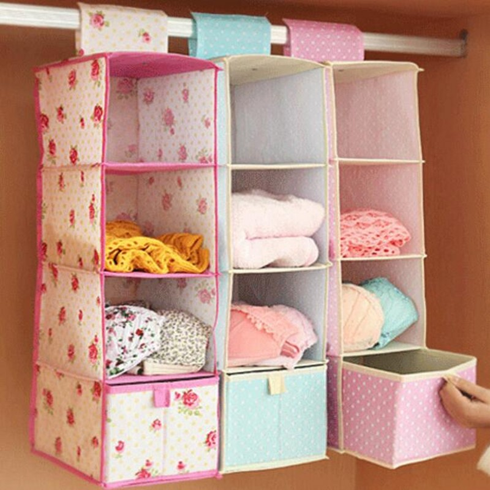
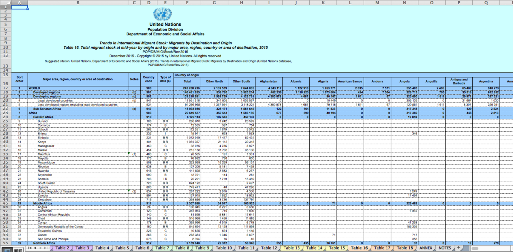
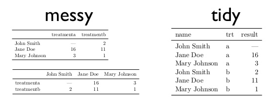

```{r setup, include=FALSE}
knitr::opts_chunk$set(echo = TRUE, warning = FALSE, message = FALSE, cache = FALSE, tidy = TRUE, tidy.opts = list(width.cutoff = 50))
library(tidyverse)
library(broom)
library(kableExtra)
options("kableExtra.html.bsTable" = T)
```

# Welcome

## For next, you need: {.small .build}


* Create a [github](https://github.com/) account
* Install the knitr, rmarkdown and kableExtra packages

## Reproducible research in R {.build}

First steps

* Who has never used R? [Swirl](https://www.youtube.com/watch?v=w6L7Ye18yPE&feature=youtu.be)
* Lots of guided personal work
* Page where [the entire course](https://sustainscapes.github.io/Libro/_book/index.html) is 

# How data is organized in r

## Data structures {.build}

<div style="float: left; width: 40%;">

- Vector: A linear set of data (gene sequence, time series)
- Matrix: A table with only numbers
- Data Frame: A table where each column has a data type (gold standard)
- List: Here we can put whatever we want

</div>

<div style="float: right; width: 60%;">

```{r, echo = FALSE}
knitr::include_graphics("Data.png")
```

</div>

## Vector {.build}

<div style="float: left; width: 40%;">

* Linear sequence of data
* They can be of many types (numeric, character, logical, etc.)
* Example data(uspop)
* to create one c(1,4,6,7,8)
* to subset a vector put the index between []
* uspop[4], uspop[2:10], uspop[c(3,5,8)]

</div>

<div style="float: right; width: 60%;">

```{r, echo = FALSE}
knitr::include_graphics("Vector.jpg")
```

</div>

## Data Frame {.build}

<div style="float: left; width: 40%;">

* A table, each column a data type (Numeric, logical, etc)
* Each column a vector
* Example data(iris)
* To subset data.frame[rows,columns]
* Examples iris[,3], iris["Petal.Length"], iris[2:5,c(1,5)], iris$Petal.Length


</div>

<div style="float: right; width: 60%;">

```{r, echo = FALSE}

```

</div>

# Tidydata principles

## Tidy Data  {.build}

```{r, echo = FALSE}
knitr::include_graphics("tidy.png")
```

* Each column a variable
* Each row one observation

## untidy data

```{r, echo=FALSE, message = FALSE, warning = FALSE,fig.width=8,fig.height=4.5,dpi=300,out.width="960px",out.height="700px"}
library(knitr)

```

## untidy data

```{r, echo=FALSE, message = FALSE, warning = FALSE,fig.width=8,fig.height=3,dpi=300,out.width="960px",out.height="450px"}

```

## untidy data {.small .build}

<div style="float: left; width: 40%;">

* Contingency tables
* Example data(HairEyeColor)

</div>

<div style="float: right; width: 60%;">

```{r, echo = FALSE}
data("HairEyeColor")
knitr::kable(HairEyeColor[,,1]) %>% kable_styling(bootstrap_options = c("striped", "hover", "condensed", "responsive"), full_width = F)
```

</div>

### Tidy option

```{r, echo=FALSE}
library(epitools)
library(knitr)
H <- as.data.frame(HairEyeColor)
kable(H) %>% kable_styling(bootstrap_options = c("striped", "hover", "condensed", "responsive"), full_width = F) %>% scroll_box()
```

# Lets work with tidy data

## dplyr {.build}

* A package with a few [very powerfull functions](https://raw.githubusercontent.com/rstudio/cheatsheets/main/data-transformation.pdf) to wrangle data 
* Part of [tidyverse](https://www.tidyverse.org/)

- *group_by* (group data)
- *summarize* 
- *filter* (Find rows with certain conditions)
- *select* together with *starts_with*, *ends_with* or *contains*
- *mutate* (Generates new variables)
- *%>%* pipeline
- *arrange* sorts

## summarize and group_by {.build .small}

- *group_by* groups observations according to a variable
- *summarize* 

```{r, eval=FALSE, echo = TRUE}
library(tidyverse)
Summary.Petal <- summarize(iris, Mean.Petal.Length = mean(Petal.Length), SD.Petal.Length = sd(Petal.Length))
```


```{r, echo = FALSE}
library(dplyr)
library(knitr)
Summary.Petal <- summarize(iris, Mean.Petal.Length = mean(Petal.Length), SD.Petal.Length = sd(Petal.Length))

kable(Summary.Petal) %>% kable_styling(bootstrap_options = c("striped", "hover", "condensed", "responsive"), full_width = F)
```

## summarize and group_by (continued) {.small .build}

```{r, eval = FALSE}
Summary.Petal <- group_by(iris, Species)
Summary.Petal <- summarize(Summary.Petal, Mean.Petal.Length = mean(Petal.Length), SD.Petal.Length = sd(Petal.Length))
```


```{r, echo = FALSE}
library(dplyr)
library(knitr)
Summary.Petal <- group_by(iris, Species)
Summary.Petal <- summarize(Summary.Petal, Mean.Petal.Length = mean(Petal.Length), SD.Petal.Length = sd(Petal.Length))
kable(Summary.Petal) %>% kable_styling(bootstrap_options = c("striped", "hover", "condensed", "responsive"), full_width = F)
```

## summarize and group_by (continued) {.small .build}
   
* Can group more than one variable at a time

```{r, eval = FALSE}
data("mtcars")
Mtcars2 <- group_by(mtcars, am, cyl)
Consumo <- summarize(Mtcars2, Average_MPG = mean(mpg), desv = sd(mpg))
```


```{r, echo = FALSE}

data("mtcars")
Mtcars2 <- group_by(mtcars, am, cyl)
MPG <- summarize(Mtcars2, Average_MPG = mean(mpg), desv = sd(mpg))
kable(MPG) %>% kable_styling(bootstrap_options = c("striped", "hover", "condensed", "responsive"), full_width = F)
```

# Doubts?

## mutate {.small}

* Creates new variables

```{r, eval = FALSE}
DF <- mutate(iris, Petal.Sepal.Ratio = Petal.Length/Sepal.Length)
```

```{r, echo = FALSE}
DF <- mutate(iris, Petal.Sepal.Ratio = round((Petal.Length/Sepal.Length),2))

kable(DF[seq(from = 15, to = 150, length.out = 10),], row.names = FALSE) %>% kable_styling(bootstrap_options = c("striped", "hover", "condensed", "responsive"), full_width = F) %>% scroll_box(width = "900px", height = "200px")
```

## Pipeline (%>%) {.small .build}

- To perform multiple operations sequentially
- without resorting to nested parentheses
- overwrite multiple databases

```{r, eval=FALSE}
x <- c(1,4,6,8)
y <- round(mean(sqrt(log(x))),2)
```

- What did we do there?

```{r, eval=FALSE}
x <- c(1,4,6,8)
y <- x %>% log() %>% sqrt() %>% mean() %>% round(2)
```

```{r, echo=FALSE}
x <- c(1,4,6,8)
x %>% log() %>% sqrt() %>% mean() %>% round(2)
```

## Pipeline (%>%) {.small .build}

* A lot of intermediate objects

```{r, eval=FALSE}
DF <- mutate(iris, Petal.Sepal.Ratio = Petal.Length/Sepal.Length)
BySpecies <- group_by(DF, Species)
Summary.Byspecies <- summarize(BySpecies, MEAN = mean(Petal.Sepal.Ratio), SD = sd(Petal.Sepal.Ratio))
```


```{r, echo=FALSE}
DF <- mutate(iris, Petal.Sepal.Ratio = Petal.Length/Sepal.Length)
BySpecies <- group_by(DF, Species)
Summary.Byspecies <- summarize(BySpecies, MEAN = mean(Petal.Sepal.Ratio), SD = sd(Petal.Sepal.Ratio))
kable(Summary.Byspecies) %>% kable_styling(bootstrap_options = c("striped", "hover", "condensed", "responsive"), full_width = F)
```

## Pipeline (%>%) {.small .build}

* With pipe

```{r, eval=FALSE}
Summary.Byspecies <- summarize(group_by(mutate(iris, Petal.Sepal.Ratio = Petal.Length/Sepal.Length), Species), MEAN = mean(Petal.Sepal.Ratio), SD = sd(Petal.Sepal.Ratio))
```


```{r, echo=FALSE}
Summary.Byspecies <- summarize(group_by(mutate(iris, Petal.Sepal.Ratio = Petal.Length/Sepal.Length), Species), MEAN = mean(Petal.Sepal.Ratio), SD = sd(Petal.Sepal.Ratio))

kable(Summary.Byspecies) %>% kable_styling(bootstrap_options = c("striped", "hover", "condensed", "responsive"), full_width = F)
```


## Pipeline (%>%) another example

```{r, eval=FALSE}
library(tidyverse)
MEAN <- iris %>% group_by(Species) %>% summarize_all(.funs = list(Mean = mean, SD =sd))
```

```{r, echo=FALSE}
library(dplyr)
library(knitr)
MEAN <- iris %>% group_by(Species) %>% summarize_all(.funs = list(Mean = mean, SD =sd))
kable(MEAN) %>% kable_styling(bootstrap_options = c("striped", "hover", "condensed", "responsive"), full_width = F)
```

# More doubts?

## Filter {.build}

- Select according to one or more variables

```{r, echo=FALSE}
DF <- data.frame(Symbol = c(">", "<", "==", ">=", "<="), Meaning = c("Greater than", "Less than", "Equal to", "Greater than or equal to", "Less than or equal to"), simbolo_cont = c("!=","%in%", "is.na", "!is.na", "| &"), significado_cont = c("other than", "within the group", "is NA", "is not NA", "or, and"))
kable(DF) %>% kable_styling(bootstrap_options = c("striped", "hover", "condensed", "responsive"), full_width = F)
```

## Examples of filter added to what we did {.small}

```{r, eval = FALSE}
data("iris")
DF <- iris %>% filter(Species != "versicolor") %>% group_by(Species) %>% summarise_all(mean)
```

```{r, echo = FALSE}
library(dplyr)
data("iris")
DF <- iris %>% filter(Species != "versicolor") %>% group_by(Species) %>% summarise_all(mean)
kable(DF) %>% kable_styling(bootstrap_options = c("striped", "hover", "condensed", "responsive"), full_width = F)
```

## Examples of filter {.small}

```{r, eval = FALSE}
DF <- iris %>% filter(Petal.Length >= 4 & Sepal.Length >= 5) %>% group_by(Species) %>% summarise(N = n())
```

```{r, echo = FALSE}
DF <- iris %>% filter(Petal.Length >= 4 & Sepal.Length >= 5) %>% group_by(Species) %>% summarise(N = n())
kable(DF) %>% kable_styling(bootstrap_options = c("striped", "hover", "condensed", "responsive"), full_width = F)
```


## More than one functiin {.small}

```{r, eval = FALSE}
data("iris")
DF <- iris %>% filter(Species != "versicolor") %>% group_by(Species) %>% summarise_all(.funs= list(Mean  = mean, SD = sd))
```

```{r, echo = FALSE}
library(dplyr)
data("iris")
DF <- iris %>% filter(Species != "versicolor") %>% group_by(Species) %>% summarise_all(.funs= list(Mean  = mean, SD = sd))
kable(DF) %>% kable_styling(bootstrap_options = c("striped", "hover", "condensed", "responsive"), full_width = F)
```

## Select {.small .build}

<div style="float: left; width: 40%;">

* Selects columns within a data.frame, or take them out

```{r, eval=FALSE}
iris %>% group_by(Species) %>% select(Petal.Length, Petal.Width) %>% summarize_all(mean)
```

```{r, eval=FALSE}
iris %>% group_by(Species) %>% select(-Sepal.Length, -Sepal.Width) %>% summarize_all(mean)
```

```{r, eval=FALSE}
iris %>% group_by(Species) %>% select(contains("Petal")) %>% summarize_all(mean)
```

```{r, eval=FALSE}
iris %>% group_by(Species) %>% select(-contains("Sepal")) %>% summarize_all(mean)
```

```{r, echo = FALSE}
DF <- iris %>% group_by(Species) %>% select(-contains("Sepal")) %>% summarize_all(mean)
```
</div>

<div style="float: right; width: 60%;">


```{r, echo = FALSE}
kable(DF) %>% kable_styling(bootstrap_options = c("striped", "hover", "condensed", "responsive"), full_width = F)
```

</div>

# Excercices

## Excercices {.build .small}

```{r}
Active_Cases <- read_csv("https://raw.githubusercontent.com/MinCiencia/Datos-COVID19/master/output/producto19/CasosActivosPorComuna_std.csv")
```


Using the repository database of the ministry of science of chile, generate a dataframe that answers the following:

* What proportion of the communes has had at some point more than 50 cases per 100,000 inhabitants?
* Generates a dataframe, where it appears for each commune that has had over 50 cases per 100,000 inhabitants, how many days it has had over that value.
* Generates a table of which communes have had over 50 cases per 100,000 inhabitants and from those communes creates a variable that is the maximum prevalence of said commune.

## **Bonus** (This requires research not enough what we learned)

* See which are the 10 communes that have had the highest median prevalence, for each of these 10 communes, generate a table with the median, maximum prevalence and date on which the maximum prevalence was reached 
