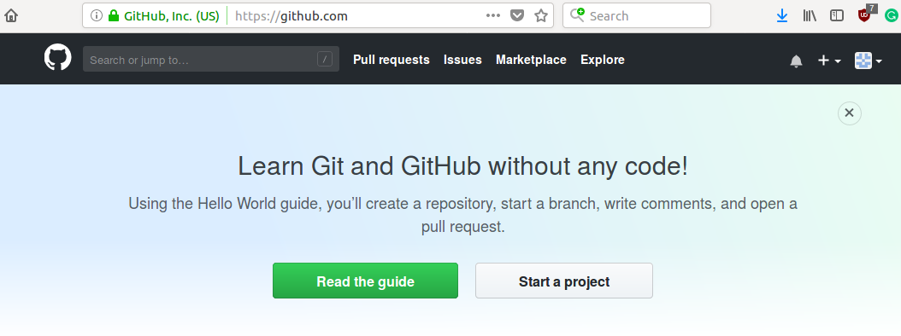
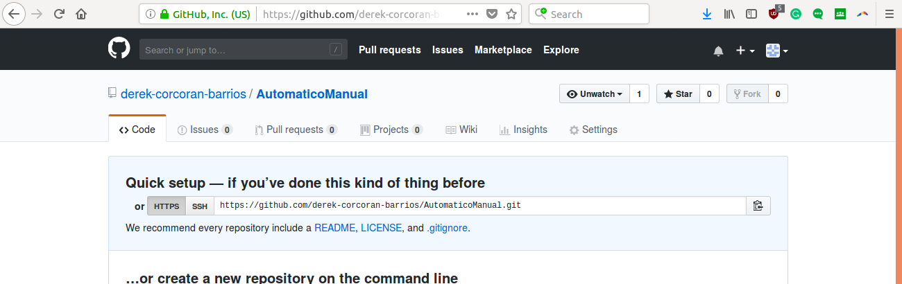
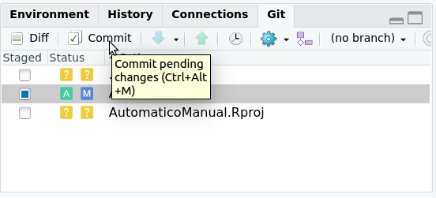
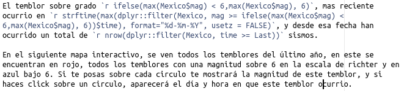
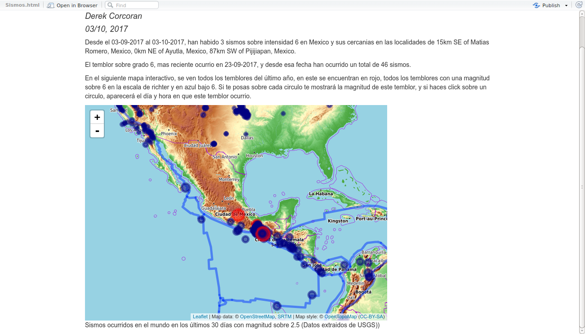

```{r setup, include=FALSE}
knitr::opts_chunk$set(echo = TRUE, warning = FALSE, message = FALSE, cache = FALSE, tidy = TRUE, tidy.opts = list(width.cutoff = 50))
library(tidyverse)
library(broom)
library(kableExtra)
options("kableExtra.html.bsTable" = T)
```

## What is reproducible research?

```{r, message=FALSE, echo=FALSE, warning=FALSE}
if (!require("pacman")) install.packages("pacman")
pacman::p_load(ggmap, ggplot2, dplyr, readr, leaflet, dygraphs, xts, lubridate, geojsonio)
```

* Interlaced code, data (**Raw**) and text
* Repos on github
* in R: Rmarkdown (Rmd)

```{r, echo = FALSE, out.width = "1000px"}
knitr::include_graphics("Reproducible.png")
```

## Goals for today {.build}

1. First commit on github
2. A code in a chunk
3. An inlinecode
4. A table in the Rmarkdown
5. Generate a first data exploration with the database

# Github

## Github

* Like "Google Drive" or "Dropbox" for code
* Change control (We can go back to any previous version)
* Code-based (ideally), but there are GUIs
* Each project is a repository

```{r, echo=FALSE}
knitr::include_graphics("Octocat.png")
```

## Create first repository

- Create account on github.com
- Generate to GitPat `usethis::create_github_token()`
- Store it with `gitcreds::gitcreds_set()`
- Check it with `usethis::git_sitrep()`
- Create repository on github

```{r, echo = FALSE, out.width='80%', fig.asp=.75, fig.align="center"}

```

## Create first repository

```{r, echo = FALSE, out.width='80%', fig.asp=.75, fig.align="center"}
knitr::include_graphics("NombreRepo.png")
```

## Copy the url

```{r, echo = FALSE, out.width='80%', fig.asp=.75, fig.align="center"}

```

## Let's go back to RStudio

* We create a new project

```{r, echo = FALSE, out.width='80%', fig.asp=.75, fig.align="center"}
knitr::include_graphics("NewProject.png")
```

## Paste the URL 

```{r, echo = FALSE, out.width='80%', fig.asp=.75, fig.align="center"}
knitr::include_graphics("GitRstudio.png")
```

## The new git tab

```{r, echo = FALSE, out.width='80%', fig.asp=.75, fig.align="center"}
knitr::include_graphics("GitPan.png")
```

## The three?" repository steps

* **Git add:** Add to the files to save
* **Git commit:** Save to local repository (My computer)
* **Git push:** Save to remote repository (In the cloud)
* Others like git merge, git pull, git clone, etc.

## Git Add

* Add a file to the repository
* When not to do it?
     + Limit of a file of 100 Mb (Git Ignore)
     + Repository limit of one Gb
     + There are opitons such as [DVC](https://dvc.org/) and/or [Piggyback](https://docs.ropensci.org/piggyback/)

```{r, echo = FALSE, out.width='80%', fig.asp=.75, fig.align="center"}
knitr::include_graphics("GitAdd.png")
```

## Git commit

* With this you say I want to save my changes on my hard drive
* It is saved in your local repository (Your computer)

```{r, echo = FALSE, out.width='80%', fig.asp=.75, fig.align="center"}

```

## commit message

* Must be relevant (example, don't put *Final Version 3, now I got it!*)
* If you make a mistake you can restore to any previous commit (if you know what it is)

```{r, echo = FALSE, out.width='80%', fig.asp=.75, fig.align="center"}
knitr::include_graphics("MensajeCommit.png")
```

## Save the repository (git push)

* With this you upload your commit to the cloud (it is backed up)

```{r, echo = FALSE, out.width='80%', fig.asp=.75, fig.align="center"}
knitr::include_graphics("Push.png")
```

# Classic mistake

## Configure github

```{r, echo = T, eval = F}
git config --global user.name "derek-corcoran-barrios"
git config --global user.email "derek-corcoran-barrios@gmail.com"
```

## If that does not work

* If you use windows install [git](https://git-scm.com/download/win)
* If you use [mac](https://git-scm.com/download/mac)
* If you use linux 

```{r, echo = T, eval=FALSE}
sudo apt-get update
sudo apt-get install git
```

# Doubts?

## Reproducibility en R

```{r, echo = F, out.width='30%', fig.align='center'}
knitr::include_graphics("Rmark.png")
```

1. A folder
     + Raw data (csv, xls, html, json)
     + Code and text (Rmd, Rpres, shiny)
     + Results (Manuscript, Web Page, App)

## Before you begin (import data)

* So far we have used `data` (only for databases built into R)
* From today we will use `read_csv` (For csv, for other files there are other functions)

## Datos para trabajar

```{r, eval = F, echo = T}
plants <- readr::read_csv('https://raw.githubusercontent.com/rfordatascience/tidytuesday/master/data/2020/2020-08-18/plants.csv')
actions <- readr::read_csv('https://raw.githubusercontent.com/rfordatascience/tidytuesday/master/data/2020/2020-08-18/actions.csv')
threats <- readr::read_csv('https://raw.githubusercontent.com/rfordatascience/tidytuesday/master/data/2020/2020-08-18/threats.csv')
```


## Crear un nuevo Rmarkdown

```{r, echo = F, out.width='100%', fig.align='center'}
knitr::include_graphics("https://archive.org/download/NewRmd/NewRmd.png")
```

## Partes de un Rmd

<div class="columns-2">
  1. Texto
  2. Cunks
  3. Inline code
  4. [Cheat sheet Rmd](https://www.rstudio.com/wp-content/uploads/2015/02/rmarkdown-cheatsheet.pdf)
  5. El botón mágico **Knit**

```{r, echo = FALSE}
knitr::include_graphics("RMDexample.png")
```

</div>

## Texto

[link](https://stackoverflow.com/users/3808018/derek-corcoran)

```{r, echo = TRUE, eval=FALSE}
# Titulo

## subtitulo

*cursiva*

**negrita**

[link](https://stackoverflow.com/users/3808018/derek-corcoran)
```


## Chunks

```{r}
knitr::include_graphics("Chunk.png")
```

+ *echo* = T o F muestro o no codigo
+ *message* = T o F muestra mensajes de paquetes
+ *warning* = T o F muestra advertencias 
+ *eval* = T o F evaluar o no el código
+ *cache* = T o F guarda o no el resultado
+ Para más opciones ver este [link](https://yihui.name/knitr/options/)

## Inline code



- Código entrelazado en el texto
- Para actualizar medias, máximos, mínimos
- Valores de p, diferencias estadísticas
- Pueden ser vectores, no tablas.

## Ejemplo

Pueden copiar el codigo de el siguiente [link](https://raw.githubusercontent.com/derek-corcoran-barrios/CursoR/master/Clase1/Sismos.Rmd), copiarlo en un archivo rmd, apretar knit y debieran ver algo como esto:



# Tablas

## Tablas: Kable

* kable parte de knitr, tabla igual a lo ingresado 
* KableExtra lo [mejora](https://cran.r-project.org/web/packages/kableExtra/vignettes/awesome_table_in_html.html)

## Ejemplo

```{r}
data("msleep")
Tabla <- msleep %>% group_by(vore) %>% summarise_at("sleep_total", .funs = list(Mean = mean, SD = sd)) %>% arrange(desc(Mean))

kable(Tabla)
```

## Mejoremos un poco

```{r}
kable(Tabla, digits = 2)
```


## KableExtra

```{r}
kable(Tabla, digits = 2) %>%
  kable_styling(bootstrap_options = c("striped", "hover", "condensed"))
```

## KableExtra (cont.)

```{r}
kable(Tabla, digits = 2) %>%
  kable_styling(bootstrap_options = c("striped", "hover", "condensed"), full_width = F)
```

## Tablas largas

```{r}
msleep_long <- msleep %>% dplyr::select(name, vore, sleep_total, brainwt)

kable(msleep_long, digits = 2, caption = "La base de datos entera") %>%
  kable_styling(bootstrap_options = c("striped", "hover", "condensed"), full_width = F) %>%
  scroll_box(width = "800px", height = "200px")
```


## Armemos nuestras propias tablas!!!


# Estamos por hoy

## Tarea

* Hagan un Rmd con datos para el reporte de felicidad
* Traten de aplicar todo lo que aprendimos hoy
    + Crear un github
    + generar un Rmd
    + Usar chunks e inline code
    + Hacer tablas resumen

```{r}
World_20Happiness_20Report <- read_csv("https://raw.githubusercontent.com/PhilippeCodes/World-Happiness-Report-Data-Analysis/master/World%20Happiness%20Report.csv")
```

