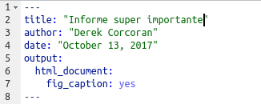
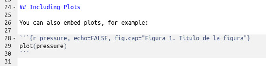
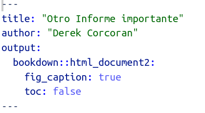
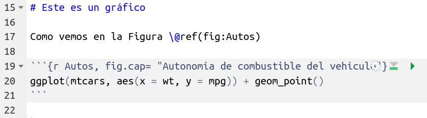
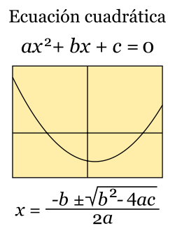

```{r setup, include=FALSE}
knitr::opts_chunk$set(echo = TRUE, warning = FALSE, message = FALSE, cache = FALSE, tidy = TRUE, tidy.opts = list(width.cutoff = 50))
library(tidyverse)
library(broom)
library(kableExtra)
library(knitr)
options("kableExtra.html.bsTable" = T)
```

## ggplot2

* ggplot(data.frame, aes(column_name))
* + geom_something(arguments, aes(column_name))
* + theme_something() style
* Customization of axes and legends
* Two [links](https://ggplot2.tidyverse.org/) to learn [more](https://raw.githubusercontent.com/rstudio/cheatsheets/master/data-visualization-2.1.pdf).

```{r, eval=FALSE}
library(tidyverse)
data("diamonds")
ggplot(diamonds, aes(x = carat, y=price)) + geom_point(aes(color = cut)) + theme_bw()
```

## Example

```{r, echo=FALSE}
ggplot(diamonds, aes(x = carat, y=price)) + geom_point(aes(color = cut)) + theme_bw()
```

## What is aes() and why +?

* In ggplot2 every time we mention a column it must be inside aes()
* ggplot2 is the oldest package in tidyverse, %>% did not exist


## Arguments for geoms

* **color**: color of lines or points 
* **alpha**: transparency, from 0 (transparent) to 1 (solid)
* **size**: size of dots or other geoms
* **shape**: type of point
* **fill**: color within an area (bars, intervals, maps)

## color

```{r}
ggplot(diamonds, aes(x = carat, y=price)) + geom_point(aes(color = cut)) + theme_bw()
```

## alpha

```{r}
ggplot(diamonds, aes(x = carat, y=price)) + geom_point(aes(color = cut), alpha = 0.1) + theme_bw()
```

## size

```{r}
ggplot(mtcars, aes(x = wt, y=mpg)) + geom_point(aes(size = hp)) + theme_bw()
```

## shape

```{r}
ggplot(diamonds, aes(x = carat, y=price)) + geom_point(aes(shape = cut, color = cut)) + theme_bw()
```

## fill

```{r}
ggplot(iris, aes(x = Species, y=Sepal.Width)) + geom_boxplot(aes(fill = Species), notch = T) + theme_bw()
```

# One categoric one continuous variable

## One categorical variable one continuous

* geom_boxplot
* geom_jitter
* geom_violin
* geom_bar

## geom_jitter

```{r}
ggplot(iris, aes(x = Species, y = Sepal.Width)) + geom_jitter(aes(color = Species))
```

## geom_violin

```{r}
ggplot(iris, aes(x = Species, y = Sepal.Width)) + geom_violin(fill = "red")
```

## You can combine them

```{r}
ggplot(iris, aes(x = Species, y = Sepal.Width)) + geom_violin() + geom_jitter(aes(color = Species))
```

## But the order matters

```{r}
ggplot(iris, aes(x = Species, y = Sepal.Width)) + geom_jitter(aes(color = Species)) + geom_violin()
```

# How to reorder variables

## fct_reorder (Reorder by another variable)


```{r}
ggplot(iris, aes(x = fct_reorder(Species, Sepal.Width), y=Sepal.Width)) + geom_boxplot(aes(fill = Species), notch = T) + theme_bw()
```

## fct_reorder (cont)


```{r}
ggplot(iris, aes(x = fct_reorder(Species, Sepal.Width), y=Sepal.Width)) + geom_boxplot(aes(fill = Species), notch = T) + theme_bw() + xlab("lo que se me ocurra")
```

## fct_relevel

```{r}
ggplot(iris, aes(x = fct_relevel(Species, "setosa", "virginica"), y=Sepal.Width)) + geom_boxplot(aes(fill = Species), notch = T) + theme_bw() + xlab("lo que se me ocurra")
```

# Lets apply it to an Rmd

## include it in an rmd with a leyend

```{r, echo=FALSE, out.width="500px"}

```


```{r, echo=FALSE, out.width="500px"}

```

## Add refernces with bookdown

```{r, echo=FALSE, out.width="300px"}

```

```{r, echo=FALSE, out.width="600px"}

```

* The same for tables but with \ref(tab:Name)

## Two continuous variables

* geom_point
* geom_smooth
* geom_line
* geom_hex
* geom_rug

## geom_hex

```{r}
ggplot(diamonds, aes(carat, price)) + geom_hex() + scale_fill_viridis_c()
```

## geom_point and geom_smooth

```{r}
data("mtcars")
ggplot(mtcars, aes(x = wt, y = mpg)) + geom_smooth() + geom_point()
```

## geom_smooth, method

```{r}
data("mtcars")
ggplot(mtcars, aes(x = wt, y = mpg)) + geom_smooth(method = "lm") + geom_point()
```

## Temperature and humidity data

```{r}
githubURL <- ("https://raw.githubusercontent.com/derek-corcoran-barrios/derek-corcoran-barrios.github.io/master/Clase4/TempHum.rds")
download.file(githubURL,"TempHum.rds", method="curl")
TempHum <- read_rds("TempHum.rds") %>% 
  mutate(Mes = as.numeric(Mes))
```


## stat_smooth más control que geom_smooth

```{r}
library(tidyverse)
PA <- TempHum %>% filter(Ciudad_localidad == "Punta Arenas") 
```

```{r, echo = FALSE}
kable(PA) %>% kable_styling(bootstrap_options = c("striped")) %>%
  scroll_box(width = "800px", height = "350px")
```


## stat_smooth más control que geom_smooth

```{r}
library(ggplot2)
ggplot(PA, aes(x = Mes, y = Temperatura)) + geom_point()
```

## stat_smooth más control que geom_smooth

```{r}
ggplot(PA, aes(x = Mes, y = Temperatura)) + geom_point() +  stat_smooth(method = "lm") 
```

## Ecuación cuadrática

```{r, echo=FALSE, out.width="400px"}
library(knitr)

```


## stat_smooth más control que geom_smooth

```{r}
ggplot(PA, aes(x = Mes, y = Temperatura)) + geom_point() +  stat_smooth(method = "lm", formula = y ~ x + I(x^2)) 
```

## Que podemos hacer con tidyr??

```{r}
library(tidyr)
San <- TempHum %>% filter(Ciudad_localidad == "Quinta Normal") %>%  pivot_longer(cols = c(Temperatura, Humedad),names_to= "Unidad", values_to = "medida")
```

## Que podemos hacer con tidyr?? (Cont.)

```{r}
ggplot(San, aes(x = Mes, y = medida)) + geom_point() +  stat_smooth(method = "lm", formula = y ~ x + I(x^2), aes(fill = Unidad, color = Unidad)) 
```


# Varios gráficos juntos

## Como combinar gráficos con facet_wrap

```{r}
Algunos <- TempHum %>% filter(Ciudad_localidad %in% c("Arica", "Rapa Nui", "La Serena", "Valparaíso", "Quinta Normal", "Concepción", "Valdivia", "Punta Arenas")) %>% pivot_longer(cols = c(Temperatura, Humedad),names_to= "Unidad", values_to = "medida")

```

## Como combinar gráficos

```{r}
ggplot(Algunos , aes(x = Mes, y = medida)) + geom_point(aes(color = Unidad)) +  stat_smooth(method = "lm", formula = y ~ x + I(x^2), aes(fill = Unidad, color = Unidad), alpha = 0.5) + facet_wrap(~Ciudad_localidad, ncol = 2)
```

# Maps in ggplot2

## Maps in ggplot2

```{r, echo = FALSE, out.width="500px", fig.align='center'}
#knitr::include_graphics("https://ia803206.us.archive.org/23/items/Comunas/Metropolitana_Map_Comunas.gif")
knitr::include_graphics("/home/derek/derek-corcoran-barrios.github.io/Clase4/Patagonia_Chile23.jpeg")
```


* si les interesea vean [este curso](https://www.youtube.com/playlist?list=PLJWf8KLNrnT50HNhrGRpwNOOsf5XiTH2E), en particular la clase 5 de graficar mapas