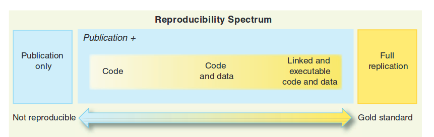
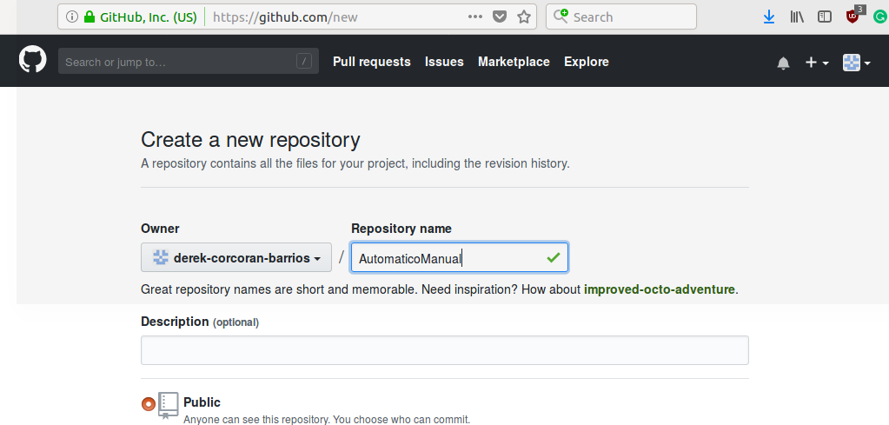
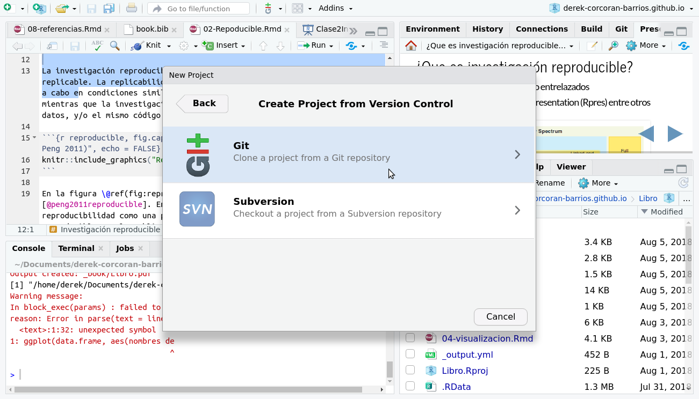

# Reproducible research {#reproducible}

## Packages needed for this chapter

For this chapter you need to have the *rmarkdown*, *knitr*, *reprex* and *kableExtra* packages installed.

This chapter will explain what reproducible research is, how to apply it using github plus the *rmarkdown* [@Allaire2018] and *knitr* [@xie2015] packages. Also, you will learn how to use tables using *knitr* [@xie2015] and *kableExtra* [@Hao2021]. In order to use GitHub you need a GitPat, in order to get that, an easy option to generate it through the *usethis* package [@WickhamUsethis]. Finally you will learn how use reprex in order to generate reproducible questions in stackoverflow. 

This class of the course can also be followed at this [link](https://sustainscapes.github.io/Class2/Class2ReproducibleResearch). 


## Reproducible Research

Reproducible research is not the same as replicable research. Replicability implies that experiments or studies carried out under similar conditions will lead to similar conclusions. Reproducible research implies that from the same data and/or the same code the same results will be generated.

```{r reproducible, fig.cap= "Continuum of reproducibility (extracted from Peng 2011)", echo = FALSE, out.width='80%', fig.asp=.75, fig.align='center' }

```

In the figure \@ref(fig:reproducible) we see the reproducibility continuum [@peng2011reproducible]. In this continuum we have the example of non-reproducibility as a post without code. It goes from less reproducible to more reproducible by the publication and the code that generated the results and graphs; followed by the publication, the code and the data that generate the results and graphs; and finally code, data and text intertwined in such a way that when running the code we get exactly the same publication that we read.

This has many advantages, including making it easier to apply the exact same methods to another database. It is enough to put the new database in the format that the author of the first publication had and we can compare the results.

Also, at a time when science is increasingly database-based, data collection and/or sampling can be put into code.

## Saving our project on github

### What is github?

Github is a kind of dropbox or google drive designed for reproducible research, where each project is a *repository*. Most researchers working on reproducible research leave all of their documented work in their repositories, allowing you to interact with other authors.

### creating a github project in RStudio

To create a project on github we press **start a project** on the home page of our account, as we see in the figure \@ref(fig:Start)

```{r Start, echo = FALSE, fig.cap= "To start a project on github, you must press Start a project on your home page", out.width='80%', fig.asp=.75 , fig.align="center"}
knitr::include_graphics("StartAProject.png")
```

Then a unique name must be created, and without changing anything else press **create repository** on the green button as we see in the figure \@ref(fig:Name).


```{r Name, echo = FALSE, fig.cap= "Create the name of your repository and press the button create repository", out.width='80%', fig.asp=.75, fig.align="center"}

```

This will take you to a page where a url of your new repository will appear as in the figure \@ref(fig:ssh)

```{r ssh, echo = FALSE, fig.cap= "The content of the box that says ssh is the url of your repository", out.width='80%', fig.asp = .75, fig.align='center'}
knitr::include_graphics("GitAdress.png")
```

To incorporate your project into your repository, the first thing you need to do is generate a project in RStudio. For this you must go in the top menu of *Rstudio* to *File > New Project > Git* as seen in the figures \@ref(fig:NewProject) and \@ref(fig:NewProject).  

```{r NewProject, echo = FALSE, fig.cap= "Menu to create a new project", out.width='80%', fig.asp=.75, fig.align='center'}
knitr::include_graphics("NewProject.png")
```

```{r Git, echo = FALSE, fig.cap= "Select git within the options", out.width='80%', fig.asp=.75, fig.align='center'}

```

Then select the location of the new project and paste the url that appears in the figure \@ref(fig:ssh) in the space that says **Repository URL:**, as shown in the figure \@ref(fig:GitRstudio) .

```{r GitRstudio, echo = FALSE, fig.cap= "Paste the repository url into the Repository URL: dialog", out.width='80%', fig.asp=.75, fig.align ='center'}

```

When your R project is already following the changes on github, a git tab will appear in the upper right window of your RStudio session, as we see in the figure \@ref(fig:GitPan)

```{r GitPan, echo = FALSE, fig.cap= "Al incluir tu repositorio en tu sesión de Rstudio, aparecera la pestaña git en la ventana superior derecha", out.width='80%', fig.asp=.75, fig.align='center'}

```

### The three main steps of a repository

Github is a whole world, there are many functions and there are experts in the use of github. In this course, we will focus on the 3 main steps of a repository: *add*, *commit* and *push*. To fully understand what each of these steps means, we have to understand that there are two repositories at all times: a local one (on your computer) and a remote one (on github.com). The first two steps *add* and *commit* only output changes to your local repository. While *push* saves the changes to the remote repository.

#### git add

This function is what adds files to your local repository. Only these files will be saved on github. Github have a repository size limit of 1 GB and files of 100 MB, since although they give you unlimited repositories, the space of each one is not, particularly in terms of databases. To add a file to your repository you just have to select the files in the git tab. By doing that a green letter A will appear instead of the two yellow question marks, as we see in the figure \@ref(fig:Add). In this case we only add the file *Analisis.r* to the repository but not the rest.

```{r Add, echo = FALSE, fig.cap= "When including your repository in your Rstudio session, the git tab will appear in the upper right window", out.width='80%', fig.asp=.75, fig.align='center'}
knitr::include_graphics("GitAdd.png")
```

#### git commit

When you use the *commit* command you are saving the changes to the files you added to your local repository. To do this in Rstudio, in the same git tab, you must press the *commit* button as we see in the figure \@ref(fig:Commit).

```{r Commit, echo = FALSE, fig.cap= "To save changes to your repository, press commit in the git tab in the upper right window", out.width='80%', fig.asp=.75 , fig.align='center'}
knitr::include_graphics("Commit.png")
```

Pressing *commit* will open a pop-up window, where you will need to write a message describing what you will save. Once I've done that, press *commit* again in the popup as shown in figure \@ref(fig:MessageCommit).

```{r MessageCommit, echo = FALSE, fig.cap= "Write a message that remembers the changes you made to the popup", out.width='80%', fig.asp=.75, fig.align ='center'}
knitr::include_graphics("MensajeCommit.png")
```

#### git push

Finally, *push* will allow you to save changes to your remote repository, which secures your data in the cloud and also makes it available to other researchers. After pressing *commit* on the popup window (figure \@ref(fig:MessageCommit)), we can press *push* on the green arrow on the popup window as seen in figure \@ref(fig:push). Then we will be asked for our username and password, and we can check that our repository is online by entering our github session.

```{r push, echo = FALSE, fig.cap= "To save to the remote repository press push on the popup window", out.width='80%', fig.asp=.75, fig.align= 'center'}
knitr::include_graphics("Push.png")
```

## Reproducibility in R

There are several packages that allow us to do reproducible research in `R`, but without a doubt the most relevant are *rmarkdown* and *knitr*. Both packages work together when we generate an *Rmd* (Rmarkdown) file, in which we use text, R code and other elements at the same time to generate a word document, pdf, web page, presentation and/or web application (fig. \@ref(fig:Rmark)).

```{r Rmark, echo = FALSE, fig.cap= "The goal of Rmarkdown is to merge r code with text and data to generate a reproducible document", out.width='80%', fig.asp= .75, fig.align='center'}
knitr::include_graphics("Rmark.png")
```

### Creating an Rmarkdown

To create an Rmarkdown file, simply go to the menu *File > New file > Rmarkdown* and with that you will have created a new *Rmd* file. We will see some of the most typical elements of an Rmarkdown file.

#### Markdown

The markdown is the part of the file where we simply write text, although it has some formatting details such as generating bold text, italics, titles and subtitles.

To make text **bold**, it must be between two `**bold**` asterisks, for text to appear *italic* it must be between `*italic*` asterisks. Other examples are the titles of different levels, which are denoted with different numbers of `#`, as well as the following 4 titles or subtitles:

## subtitle 1 {-}

### subtitle 2 {-}

#### subtitle 3 {-}

##### subtitle 4 {-}

it would look like this in code

```{r, eval = FALSE}
## subtitle 1

### subtitle 2

#### subtitle 3

##### subtitle 4
```

#### Chunks

Chunks are one of the most important parts of an Rmarkdown. These are where the code from R (or other programming languages) is added. Which allows the product of our code not to be just a script with pasted results, but actually generated in the same document as our script. The easiest way to add a chunk is by pressing the *insert chunk* button in Rstudio, this button is located in the upper left window of our RStudio session, as shown in the figure \@ref(fig:Insertchunk)

```{r Insertchunk, echo = FALSE, fig.cap= "When pressing the insert chunk button, a space will appear in which to insert code", out.width='80%', fig.asp=.75, fig.align='center'}

```

By pressing this button a space will appear, there you can add a code like the one below, and see the results below.

````markdown
`r ''````{r}
library(tidyverse)
iris %>% group_by(Species) %>% summarize(Petal.Length = mean(Petal.length))
```
````


```{r, echo = FALSE}
iris %>% group_by(Species) %>% summarize(Petal.Length = mean(Petal.Length))
```


##### Chunk Options

There are many options for chunks, a complete documentation can be found at the following [link](https://yihui.name/knitr/options/), but here we will show the most common:

+ *echo* = T or F show or not the code, respectively
+ *message* = T or F displays packet messages, respectively
+ *warning* = T or F displays warnings, respectively
+ *eval* = T or F to evaluate or not the code, respectively
+ *cache* = T or F save or not the result, respectively

#### inline code

The *inline codes* are useful to add some value in the text, such as the value of p or the mean. To use it, put a backtick (backsingle quote), r, the code in question and another backtick as follows `` ``r ''`r R_code` ``. We cannot put anything in an *inline code*, since it can only generate vectors, which often requires a lot of creativity to achieve what we want. For example if we wanted to put the average sepal length of the `iris` database into an *inline code* we would put `` ``r ''`r mean(iris$Sepal.Length)` ``, which would result in `r mean(iris$Sepal.Length)`. As a number with 7 significant figures would look strange in a text, we would also like to use the `round` function, so that it has 2 significant figures, for that we put the following inline code `` ``r ''`r round(mean( iris$Sepal.Length),2)` `` which returns `r round(mean(iris$Sepal.Length),2)`. This can be made even more complex if you want to work with a summary table. For example, if we wanted to list the average sepal size we would use `summarize` from *dplyr*, but this would result in a data.frame, which doesn't appear if we try to inline code. Let's start by seeing how the code would look where we obtained the average size of the sepal.

```{r, eval = FALSE}
iris %>% group_by(Species) %>% summarize(Mean = mean(Sepal.Length))
```

We would see the result of that code \@ref(tab:SummarySepaltab)

```{r SummarySepaltab, echo = FALSE}
knitr::kable((iris %>% group_by(Species) %>% summarize(Mean = mean(Sepal.Length))), booktabs = TRUE,
  caption = 'Summary of the average length of the sepal of the flowers of the genus Iris.', row.names = FALSE)
```

To remove the mean vector from this data frame we could subset it with the `$` sign. So if we want to output the *Mean* column of the data frame we created as a vector, we would do the following `` ``r ''`r (iris %>% group_by(Species) %>% summarize(Mean = mean(Sepal.Length )))$Mean` ``. This would output `r (iris %>% group_by(Species) %>% summarize(Mean = mean(Sepal.Length)))$Mean`.

### Training

#### Exercise 1

Using the *iris* database, create an inline code that tells the average length of the petal of the species *Iris virginica*


#### Tables in Rmarkdown

The most typical function for generating tables in an *rmd* file is `kable` from the *knitr* package, which in its simplest form includes a dataframe as its only argument. In addition to this, we can add some parameters such as *caption*, which allows us to put a title to the table or *row.names*, which if put as seen in the code (FALSE) will not show the names of the rows, as seen in the table \@ref(tab:SummaryMeans).

```{r, eval = FALSE}
DF <- iris %>% group_by(Species) %>% summarize_all(mean)
kable(DF, caption = 'Average per species of all iris database variables.', row.names = FALSE)
```

```{r SummaryMeans, echo = FALSE}
knitr::kable((iris %>% group_by(Species) %>% summarize_all(mean)), booktabs = TRUE,
  caption = 'Average per species of all iris database variables.', row.names = FALSE)
```

# References