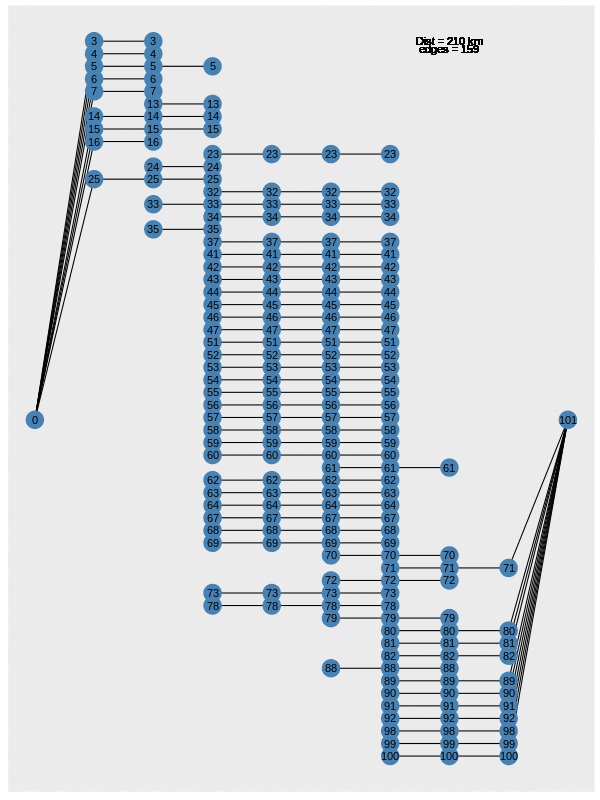

```{r setup, include=FALSE}
knitr::opts_chunk$set(echo = TRUE, 
                      warning = FALSE,
                      error = FALSE,
                      message = FALSE,
                      tidy = 'formatR',
                      cache = T)
library(SpatioTemporalCont)
library(terra)
library(tidyterra)
library(ggplot2)
library(purrr)
library(sdmTMB)
library(sdmTMB)
library(patchwork)
library(kableExtra)
library(DHARMa)
library(GeNetIt)
library(tidyr)
library(dplyr)
library(sf)
library(raster)
library(gdistance)
library(stringr)
library(tidygraph)
library(scales)
```

# Connectivity

## Why Connectivity

* Fragmentation is one of the main drivers of biodiversity loss
* It diminishes genetic diversity

```{r, echo = F}

```

# Continuous connectivity measures

## Geographic vs continuous connectivity

```{r geographiclayers}
RasterMaps <- terra::rast(system.file("extdata/covariates.tif", package="GeNetIt"))
data(ralu.site, package="GeNetIt")
sites <- ralu.site
```

```{r rasterplot, echo =FALSE}
ggplot() + geom_spatraster(data = RasterMaps["err27"]) + geom_spatvector(data = terra::vect(sites), aes(size  = AREA_m2/10000))+ scale_fill_terrain_c(name = "Elevation-Relief Ratio") + scale_size(name = "wetland area [Ha]")
```

## Variables

Rasters:

* **cti**: Compound Topographic Index (“wetness”)
* **err27**: Elevation Relief Ratio
* **ffp**: Frost Free Period
* **gsp**: Growing Season Precipitation
* **hli**: Heat Load Index
* **nlcd**: USGS Landcover (categorical map)

## Conductance in gDistance {.smaller}

Ranked by experts ordinal 1) cti, 2) gsp, 3) ffp, 4) err27  

* *err27*: The elevation relief ratio identifies significant topographic features, higher ERR27 indicate greater topographic change ~ increased resistance. has to be inverted
* *ffp* frost free preriod, the higher the value the more conductivity
* *gsp* Growing Season Precipitation, it has to be more than 196 mm for key species to be present
* *cti* Compound Topographic Index, the higher the more conductivity

```{r costlayer}
err.cost <- (1/RasterMaps[["err27"]])
ffp.cost <- (RasterMaps[["ffp"]]/5)
gsp.cost <- (RasterMaps[["gsp"]]-196)/15
cti.cost <- RasterMaps[["cti"]]/5
cost1 <- (gsp.cost + cti.cost + err.cost + ffp.cost)
```

## conductance and sampling points

```{r, echo = F}
ggplot() + geom_spatraster(data = cost1) + geom_spatvector(data = terra::vect(sites), aes(size  = AREA_m2/10000))+ scale_fill_wiki_c(name = "conductance") + scale_size(name = "wetland area [Ha]")
```

## Generating transition matrices

```{r transitionmatrix}
tr.cost1 <- gdistance::transition(raster::raster(cost1), transitionFunction=mean, directions=8)
tr.cost1 <- gdistance::geoCorrection(tr.cost1,type = "c",multpl=FALSE)
```

## Geographic path  {.smaller}

```{r geographic}
Neighbours <- terra::delaunay(vect(sites), as.lines = T)
```

```{r plot, echo=FALSE}
Transcost <- terra::rast(raster::raster(tr.cost1), crs = terra::crs(terra::vect(sites)))

TerraSites <- terra::vect(sites)

Neighbours <- terra::delaunay(vect(sites), as.lines = T)

ggplot() + geom_spatraster(data = Transcost) + scale_fill_wiki_c(name = "conductance")  + geom_spatvector(data = Neighbours, color = "darkgrey") + geom_spatvector(data = TerraSites, aes(size  = AREA_m2/10000)) + scale_size(name = "wetland area [Ha]")
```

## Add least cost {.smaller}

```{r LeastCostLines}
Lines <- list()

for(i in 1:nrow(Neighbours)){
    Temp <- as.matrix(as.data.frame(terra::intersect(terra::vect(sites), Neighbours[i,]),geom = "XY")[c("x", "y")])
    Lines[[i]] <- terra::vect(sf::st_as_sf(gdistance::shortestPath(tr.cost1, origin = Temp[1,], goal = Temp[2,], output = "SpatialLines")))
    terra::crs(Lines[[i]]) <- terra::crs(Neighbours)
}

Lines <- Lines |> purrr::reduce(rbind)
```

## Add least cost (Plot)

```{r leastCost, echo=FALSE}
ggplot() + geom_spatraster(data = Transcost) + scale_fill_wiki_c(name = "conductance")  + geom_spatvector(data = Neighbours, color = "darkgrey") + geom_spatvector(data = Lines, color = "red") + geom_spatvector(data = TerraSites, aes(size  = AREA_m2/10000)) + scale_size(name = "wetland area [Ha]")
```

## Distance Correlation

```{r Cor, echo = F, cache=TRUE}
DF <- data.frame(euclidean = terra::perim(Neighbours), LeastCost = terra::perim(Lines))

plotly::ggplotly(ggplot(DF, aes(x = euclidean, y = LeastCost)) + geom_point() + geom_abline(intercept = 0, slope = 1, col = "red", lty = 2) + theme_bw())
```

## Actual cost

```{r}
Temp <- as.matrix(as.data.frame(terra::vect(sites),geom = "XY")[c("x", "y")])

DF1 <- GeNetIt::dmatrix.df(as.matrix(gdistance::costDistance(tr.cost1, Temp))) |> dplyr::rename(least_cost = distance)

DF2 <- GeNetIt::dmatrix.df(as.matrix(gdistance::commuteDistance(tr.cost1, Temp)))  |> dplyr::rename(commute_time = distance)

DF3 <- GeNetIt::dmatrix.df(as.matrix(distance(terra::vect(sites)))) |> dplyr::rename(euclidean_dist = distance)


DF4 <- read.csv("https://raw.githubusercontent.com/Sustainscapes/Sustainscapes.github.io/master/SpatialContinuity/data/gdist.csv", header=TRUE) |> 
  dplyr::rename(from = FROM, to = TO, genetic_dist = GDIST) |> 
  dplyr::select(from, to, genetic_dist)

DF <- list(DF1, DF2, DF3, DF4) |> purrr::reduce(full_join)
```

## Comparison

```{r, echo=FALSE, cache = T}
ggplot(DF, aes(x = commute_time, y = least_cost)) + geom_point()
```

## Comparison 2

```{r, echo = F, cache=TRUE}
DF |> tidyr::pivot_longer(least_cost:euclidean_dist, names_to = "dist_type", values_to = "dist") |> ggplot(aes(x = genetic_dist, y = dist)) + geom_point() + geom_smooth() + facet_wrap(~dist_type, scales = "free")
```

# Exercise

## Check connectivity in Denmark {.smaller}

```{r toconnect, eval =TRUE, cache=T}
data("Landuse_DK")
Landuse <- terra::unwrap(Landuse_DK)
## Make sourcers to be dry nature
DryNature <- Landuse

DryNature <- terra::ifel(DryNature == "dry nature", 1, NA)

Patches <- terra::aggregate(DryNature, by = "Landuse") |> 
  as.polygons() |> 
  disagg()

Patches$Area_ha <- terra::expanse(Patches, unit = "ha")

Centroids <- terra::centroids(Patches)

Centroids_DF <- as.data.frame(Centroids, geom = "XY")
```

## Generate new landuse types {.smaller}

```{r, eval = F}
CLS1 <- levels(Landuse)[[1]]

NewCls <- data.frame(ID = c(0, 1), Type = c("Non-nature", "Nature"))

Nature <- as.numeric(Landuse)

Nature <- terra::ifel(Nature %in% c(7,8,11), 1, 0)

Nature <- mask(Nature, Landuse)

levels(Nature) <- NewCls
```

## Exercise

* Choose on of the new maps (`DryNature`, `Nature`)
* Choose one of the Landuses in `Landuse`, and check for different radiuses and generate habitat continuities using `SpatioTemporalCont::calculate_prop`
* Calculate commuteDistance and costDistance to compare with euclidean distance with the different options

# Lets work for 15 mins

# Graph based connectivity measures

## How does it work

* We generate a network of patches
* Each patch has attributes (Size, Diversity, Land use, etc)
* Each edge has attributes (Distance, conductivity/resistance)

## Pros and cons

::: {style="float: left; width: 50%;"}
**Pros**

* Computationally eficient
* Robust mathematical framework 
:::

::: {style="float: right; width: 50%;"}
**Cons**

* Generating the dataset as a network might not be as easy
* Networks are less intuitive
:::

## How to build your network {.smaller}

```{r firstpatches, cache=T}
library(sfnetworks)
Patches$ID <- 1:nrow(Patches)
Centroids$ID <- 1:nrow(Centroids)
Centroids_SF <- sf::st_as_sf(Centroids)
# Patches connected to 2000 meters
joins <- nearby(Patches, distance = 2000) |> as.data.frame() 


Edges <- purrr::map(1:nrow(joins), ~as.lines(rbind(Centroids[Centroids$ID == joins$from[.x],], Centroids[Centroids$ID == joins$to[.x],]))) |>
      purrr::reduce(rbind)

Edges$from <- joins$from
Edges$to <- joins$to

net <- sfnetworks::sfnetwork(nodes = Centroids_SF,
                      edges = sf::st_as_sf(Edges))
```

## Plot edges

```{r, cache=TRUE, echo=FALSE}
ggplot() + geom_spatvector(data = Edges)
```

## Plot Network

```{r, cache=TRUE, echo=FALSE}
autoplot(net, graticule = TRUE, axes = TRUE) + ggtitle("Edges: 2000")
```

## Several distances

```{r newedges, echo=FALSE, cache=TRUE, eval=FALSE}
library(patchwork)
Graphs <- list()

Distances <- c(2000, 5000, 10000)
for(i in 1:length(Distances)){
  Patches$ID <- 1:nrow(Patches)
Centroids$ID <- 1:nrow(Centroids)
Centroids_SF <- sf::st_as_sf(Centroids)
# Patches connected to 2000 meters
joins <- nearby(Patches, distance = Distances[i]) |> as.data.frame() 


Edges <- purrr::map(1:nrow(joins), ~as.lines(rbind(Centroids[Centroids$ID == joins$from[.x],], Centroids[Centroids$ID == joins$to[.x],]))) |>
      purrr::reduce(rbind)

Edges$from <- joins$from
Edges$to <- joins$to

net <- sfnetworks::sfnetwork(nodes = Centroids_SF,
                      edges = sf::st_as_sf(Edges))

saveRDS(net, paste0("net", Distances[i], ".rds"))

Graphs[[i]] <- autoplot(net) + labs(title = paste("Distance", Distances[i], "meters"), subtitle = paste(nrow(Edges), "edges"))

saveRDS(Graphs, paste0("Graphs", Distances[i], ".rds"))
}

```

```{r Patchwork, cache = T, echo=FALSE}
Graphs <- readRDS("Graphs5000.rds")
patchwork::wrap_plots(Graphs, nrow = 2)
```

# Network flow 

## Networks through time

* Changes in suitability through time

```{r firstplot, echo = F}
#knitr::include_graphics("Images/NF1.png")
library(dispRsal)
Problem_To_Graph <- function(habitat_layers, cost_layer, Dist){
  Masklayer <- cost_layer
  values(Masklayer) <- ifelse(is.na(values(Masklayer)), NA, 1)
  Stack <-habitat_layers * Masklayer
  accCost2 <- function(x, fromCoords) {
    
    fromCells <- cellFromXY(x, fromCoords)
    tr <- transitionMatrix(x)
    tr <- rbind(tr, rep(0, nrow(tr)))
    tr <- cbind(tr, rep(0, nrow(tr)))
    startNode <- nrow(tr)
    adjP <- cbind(rep(startNode, times = length(fromCells)), fromCells)
    tr[adjP] <- Inf
    adjacencyGraph <- graph.adjacency(tr, mode = "directed", weighted = TRUE)
    E(adjacencyGraph)$weight <- 1/E(adjacencyGraph)$weight
    return(shortest.paths(adjacencyGraph, v = startNode, mode = "out")[-startNode])
  }
  Suitability <- list()
  for (i in 1:nlayers(Stack)){
    temp <- data.frame(Suitability = values(Stack[[i]]), ID = 1:length(values(Stack[[i]])), Time = i-1)
    Suitability[[i]] <- temp[complete.cases(temp),]
  }
  Suitabilities <- do.call("rbind", Suitability)
  
  s <- Suitabilities %>% group_by(ID) %>% summarise(SUMA = sum(Suitability)) %>% filter(SUMA > 0)
  Suitabilities <- Suitabilities[Suitabilities$ID %in% s$ID,]
  Raster <- sum(Stack)
  
  Raster[values(Raster) > 0] = 1
  Raster[values(Raster) == 0] = NA
  
  h16  <- transition(Raster, transitionFunction=function(x){1},16,symm=FALSE)
  
  h16   <- geoCorrection(h16, scl=FALSE)
  
  ID <-c(1:ncell(Raster))[!is.na(values(Raster))]
  
  B <- xyFromCell(Raster, cell = ID)
  
  connections <- list()
  #For each pair of cells in B
  for (i in 1:nrow(B)){
    #Create a temporal raster for each row with the distance from cell xy to all other cells
    temp <- accCost2(h16,B[i,])
    index <- which(temp < Dist)
    connections[[i]] <- cbind(ID[i], index, temp[index])
  }
  #Get everything together as a large data frame
  connections <- do.call("rbind", connections)
  connections <- as.data.frame(connections)
  colnames(connections) <- c("from", "to", "dist")
  Cons <- list()
  
  for(i in 1:(nlayers(Stack)-1)){
    Cons[[i]] <- data.frame(Cell_From = connections$from, Cell_To = connections$to, Time_From = NA, Time_to = NA, Capacity = NA)
    Cons[[i]]$Time_From <- i-1
    Cons[[i]]$Time_to <- i
    for(j in 1:nrow(connections)){
      if((dplyr::filter(Suitabilities, ID == connections$from[j] & Time == i-1) %>% pull(Suitability)) == 1 & (dplyr::filter(Suitabilities, ID == connections$to[j] & Time == i) %>% pull(Suitability)) == 1){
        Cons[[i]]$Capacity[j] <- 1
      }
    }
  }
  
  Cons <- bind_rows(Cons) %>% dplyr::filter(Capacity == 1)
  
  Cost <- data.frame(ID = unique(c(c(Cons$Cell_To), c(Cons$Cell_From))), cost = values(PhilCost)[unique(c(c(Cons$Cell_To), c(Cons$Cell_From)))])
  
  Cost <- data.frame(ID = unique(c(c(Cons$Cell_To), c(Cons$Cell_From))), cost = values(PhilCost)[unique(c(c(Cons$Cell_To), c(Cons$Cell_From)))])
  
  Cons$Cost <- NA
  
  for(i in 1:nrow(Cons)){
    temp <- Cost %>% dplyr::filter(ID %in% unique(c(Cons$Cell_From[i], Cons$Cell_To[i])))
    if(nrow(temp) == 1){
      Cons$Cost[i] <- temp$cost*2
    }
    if(nrow(temp) == 2){
      Cons$Cost[i] <- temp %>% summarise(cost = sum(cost)) %>% pull(cost)
    }
  }
  ForSource <- Cons %>% dplyr::filter(Time_From == min(Time_From)) %>% mutate(Cell_To = Cell_From, Cell_From = 0, Time_From = -1, Time_to = 0, Capacity = 1, Cost = 0)
  
  ForSink <- Cons %>% dplyr::filter(Time_to == max(Time_to)) %>% mutate(Cell_From = Cell_To, Cell_To = length(values(Stack[[1]][[1]])) + 1, Time_From = max(Time_to), Time_to = max(Time_to) + 1, Capacity = 1, Cost = 0)
  
  Cons <- bind_rows(ForSource, Cons, ForSink) %>% distinct()
  
  Cons$ID <- 1:nrow(Cons)
  
  Cons <- Cons %>% mutate(Cell_Time_From = paste(Cell_From, Time_From, sep = "_"), Cell_Time_To = paste(Cell_To, Time_to, sep = "_"))
  
  Cell_Time_Name <- unique(c(Cons$Cell_Time_From, Cons$Cell_Time_To))
  
  Cell_Time_ID_DF <- data.frame(Cell_Time_ID = 1:length(Cell_Time_Name), Cell_Time_Name = Cell_Time_Name)
  
  for(i in 1:nrow(Cell_Time_ID_DF)){
    Cons$Cell_Time_From[Cons$Cell_Time_From == Cell_Time_ID_DF$Cell_Time_Name[i]] <- Cell_Time_ID_DF$Cell_Time_ID[i]
  }
  
  for(i in 1:nrow(Cell_Time_ID_DF)){
    Cons$Cell_Time_To[Cons$Cell_Time_To == Cell_Time_ID_DF$Cell_Time_Name[i]] <- Cell_Time_ID_DF$Cell_Time_ID[i]
  }
  
  Cell_Time_ID_DF <- Cell_Time_ID_DF %>% mutate(Cell = (str_split(Cell_Time_Name,"_", simplify = T))[,1], Time = (str_split(Cell_Time_Name,"_", simplify = T))[,2])
  
  Cons <- Cons[,c(8,9,1:7)]
  library(ggraph)
  graph <- graph_from_data_frame(Cons)
  
  graph <- set_vertex_attr(graph = graph, name = "Node_Name", value = Cell_Time_ID_DF$Cell)
  
  graph <- set_vertex_attr(graph = graph, name = "Cell_Time", value = Cell_Time_ID_DF$Cell_Time_Name)
  
  coords <- data.frame(x = as.numeric(Cell_Time_ID_DF$Time), y = as.numeric(Cell_Time_ID_DF$Cell)) 
  
  coords2 <- coords %>% filter(!(y %in% c(max(y), min(y))))
  
  coords <- coords %>% mutate(y = case_when(!(y %in% c(max(y), min(y))) ~ y, y == min(y) ~ mean(y), y == max(y) ~ mean(y)))
  
  coords3 <-  data.frame(y =  sort(unique(coords2$y)), newy = NA)
  coords3$newy <- seq(from = min(coords3$y), to = max(coords3$y), length.out = nrow(coords3))
  coords <- full_join(coords, coords3) %>% mutate(y = case_when(is.na(newy) ~ y, !is.na(newy) ~newy)) %>% dplyr::select(x,y)
  
  g <- ggraph(graph, coords) + geom_edge_link() +  geom_node_point(size = 8, colour = 'steelblue') + geom_node_text(label = Cell_Time_ID_DF$Cell) + scale_y_reverse()
  return(list(g = g, graph = as_tbl_graph(graph), coords = coords))
}

data("Phillips")
PhillipsDF <- Phillips %>%
  as("SpatialPixelsDataFrame") %>%
  as.data.frame() %>% pivot_longer(starts_with("T"), names_to = "Time", values_to = "Suitability") %>% mutate(Suitability = case_when(Suitability == 1 ~ "Suitable", Suitability == 0 ~ "Unsuitable"))

PhillipsSF <-  rasterToPolygons(Phillips) %>% st_as_sf()
PhillipsSF$ID <- 1:nrow(PhillipsSF)
a <- suppressMessages(Problem_To_Graph(habitat_layers = Phillips, cost_layer = PhilCost, Dist = 111000))

b <- a$graph %>% activate(edges) %>% as.data.frame() %>% bind_cols(data.frame(flow = c(1,0,1,1,0,0,0,1,1,0,0,1)))
a$graph <- suppressMessages(a$graph %>% activate(edges) %>% full_join(b))

ggplot() + geom_sf(data = PhillipsSF, size = 0.1) + geom_sf_label(data = PhillipsSF, aes(label = ID)) + geom_tile(data = PhillipsDF, aes(x = x, y = y, fill = Suitability), alpha = 0.6) + geom_sf_label(data = PhillipsSF, aes(label = ID)) + facet_wrap(~Time) + theme_bw() + theme(panel.spacing = unit(6, "lines")) + ylab("") + xlab("")  + theme(axis.text.x = element_blank(), axis.text.y = element_blank(),axis.ticks = element_blank()) + scale_fill_manual(values = c(muted("red"), muted("blue")))
```

## Networks through time

* As a network

```{r, echo = F}
#knitr::include_graphics("Images/NF2.png")
UniCost <- PhilCost

values(UniCost) <- rep(1, ncell(PhilCost))

Y <- suppressMessages(Problem_To_Graph(habitat_layers = Phillips, cost_layer = UniCost, Dist = 111000))

Y$g
```


## Changing the dispersal

```{r, echo=FALSE}

```

## Geographic representation

```{r, out.width="60%", echo = F}
knitr::include_graphics("Images/NetworkFlow.gif")
```
